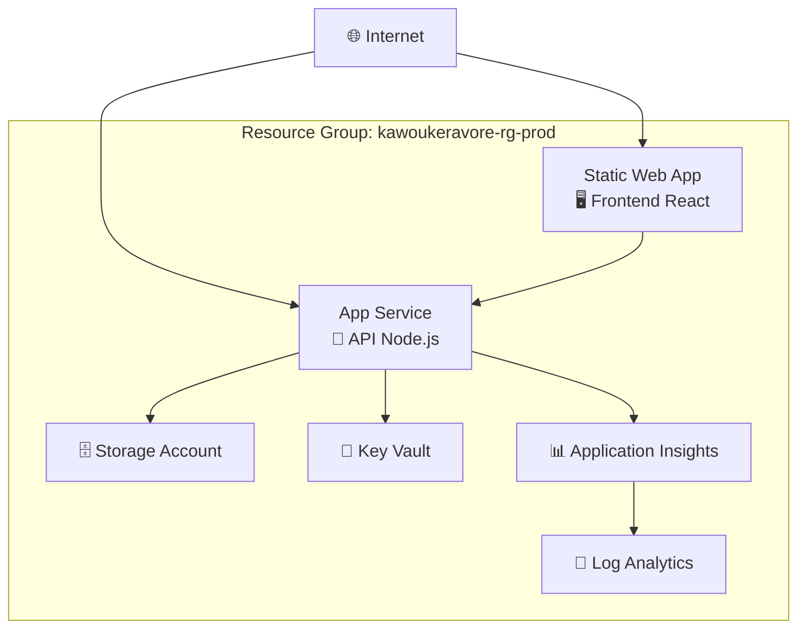

# 🚀 Guide Déploiement Azure - Kawoukeravore

Guide complet pour déployer la plateforme culturelle Kawoukeravore sur **Microsoft Azure**.

## ⚡ Déploiement Express Azure

### Option 1: GitHub Actions (Recommandé)
1. **Fork** le repository sur GitHub
2. Configurer les **secrets** dans GitHub:
   ```
   AZURE_CREDENTIALS
   AZURE_SUBSCRIPTION_ID
   AZURE_STATIC_WEB_APPS_API_TOKEN
   MICROSOFT_CLIENT_ID
   MICROSOFT_CLIENT_SECRET
   MICROSOFT_TENANT_ID
   WHATSAPP_VERIFY_TOKEN
   WHATSAPP_ACCESS_TOKEN
   JWT_SECRET
   ```
3. **Push** vers `main` → Déploiement automatique !

### Option 2: PowerShell Script
```powershell
# Cloner le repository
git clone https://github.com/cipfarorudy/kawoukeravore.git
cd kawoukeravore

# Se connecter à Azure
az login

# Déployer avec le script
.\azure-deploy.ps1 -Environment prod
```

### Option 3: Azure CLI Manuel
```bash
# Créer le Resource Group
az group create --name kawoukeravore-rg-prod --location "West Europe"

# Déployer l'infrastructure
az deployment group create \
  --resource-group kawoukeravore-rg-prod \
  --template-file azure-infrastructure.bicep \
  --parameters azure-infrastructure.parameters.json
```

## 🏗️ Architecture Azure

### Services Déployés

| Service | Purpose | SKU | URL |
|---------|---------|-----|-----|
| **App Service** | API Backend Node.js | B1 Basic | `kawoukeravore-api-prod.azurewebsites.net` |
| **Static Web App** | Frontend React | Free | `kawoukeravore-frontend-prod.azurestaticapps.net` |
| **Storage Account** | Images & médias | Standard LRS | Blob storage pour galerie |
| **Key Vault** | Secrets sécurisés | Standard | Variables sensibles |
| **Application Insights** | Monitoring & logs | Pay-as-you-go | Télémétrie applicative |
| **Log Analytics** | Centralisation logs | Pay-as-you-go | Analyse des performances |

### Diagramme de l'Infrastructure



## 🔧 Configuration Détaillée

### 1. App Service (API Backend)

**Fonctionnalités configurées:**
- ✅ Node.js 18 LTS sur Linux
- ✅ Build automatique avec Oryx
- ✅ HTTPS uniquement (SSL forcé)
- ✅ Application Insights intégré
- ✅ Variables d'environnement sécurisées
- ✅ Health check endpoint

**Variables d'environnement:**
```env
NODE_ENV=production
PORT=8000
FRONTEND_URL=https://kawoukeravore-frontend-prod.azurestaticapps.net
MICROSOFT_CLIENT_ID=<depuis Key Vault>
WHATSAPP_ACCESS_TOKEN=<depuis Key Vault>
JWT_SECRET=<généré automatiquement>
```

### 2. Static Web App (Frontend)

**Fonctionnalités configurées:**
- ✅ Build automatique depuis GitHub
- ✅ CDN global intégré
- ✅ SSL gratuit et automatique
- ✅ Routing SPA avec fallback
- ✅ Headers de sécurité
- ✅ Cache optimisé

**Configuration:**
```json
{
  "routes": [
    { "route": "/api/*", "allowedRoles": ["anonymous"] },
    { "route": "/*", "rewrite": "/index.html" }
  ],
  "globalHeaders": {
    "X-Content-Type-Options": "nosniff",
    "X-Frame-Options": "DENY",
    "Strict-Transport-Security": "max-age=31536000"
  }
}
```

### 3. Storage Account

**Containers créés:**
- `galerie` - Images de la galerie culturelle (accès public)
- `documents` - Documents privés (accès restreint)

**Configuration sécurité:**
- ✅ HTTPS uniquement (TLS 1.2+)
- ✅ Chiffrement au repos
- ✅ Accès par clés gérées
- ✅ CORS configuré pour le domaine

## 🔐 Sécurité & Secrets

### Key Vault - Gestion des Secrets

**Secrets stockés:**
```
microsoft-client-secret    # Microsoft Graph API
whatsapp-access-token     # WhatsApp Business API
jwt-secret               # Signature JWT
smtp-password           # Email SMTP
```

**Accès sécurisé:**
- Service Principal avec permissions limitées
- Rotation automatique des secrets (recommandé)
- Audit des accès dans Log Analytics

### Bonnes Pratiques Sécurité

1. **Authentification:**
   - Service Principal avec RBAC minimal
   - Managed Identity pour App Service
   - Pas de clés hardcodées

2. **Réseau:**
   - HTTPS uniquement sur tous les services
   - TLS 1.2 minimum
   - Headers de sécurité configurés

3. **Monitoring:**
   - Application Insights pour la télémétrie
   - Alertes sur les erreurs critiques
   - Logs centralisés dans Log Analytics

## 📊 Monitoring & Performance

### Application Insights

**Métriques surveillées:**
- 📈 Performance des requêtes API
- ❌ Taux d'erreur et exceptions
- 👥 Nombre d'utilisateurs actifs
- 🌍 Géolocalisation des requêtes
- 📱 Performance du frontend

**Alertes configurées:**
- Temps de réponse > 5 secondes
- Taux d'erreur > 5%
- Disponibilité < 99%

### Dashboards Recommandés

1. **Dashboard Opérationnel:**
   - Status des services en temps réel
   - Métriques de performance
   - Logs d'erreur récents

2. **Dashboard Business:**
   - Utilisation de la galerie
   - Formulaires de contact soumis
   - Pages les plus visitées

## 💰 Coûts Estimés

### Environnement Production

| Service | SKU | Coût/mois (EUR) |
|---------|-----|-----------------|
| App Service B1 | Basic | ~13€ |
| Static Web App | Free | 0€ |
| Storage Account | Standard LRS | ~2€ |
| Key Vault | Standard | ~1€ |
| Application Insights | Pay-as-go | ~5€ |
| **TOTAL** | | **~21€/mois** |

### Optimisations Coûts

1. **Développement:**
   - App Service F1 (gratuit) pour les tests
   - Partage du Storage Account

2. **Scaling:**
   - Auto-scaling basé sur CPU/Memory
   - Static Web App CDN inclus gratuitement

## 🔄 CI/CD avec GitHub Actions

### Pipeline Automatisé

**Triggers:**
- Push vers `main` → Déploiement production
- Pull Request → Tests et validation
- Release tag → Déploiement avec versioning

**Étapes du pipeline:**
1. 🧪 **Tests & Build** - Validation du code
2. 🏗️ **Infrastructure** - Déploiement Bicep
3. 🔧 **API** - Déploiement App Service
4. 🌐 **Frontend** - Déploiement Static Web App
5. ✅ **Health Checks** - Tests post-déploiement

### Environnements Multiples

```yaml
# Production (main branch)
environment: production
resource-group: kawoukeravore-rg-prod

# Staging (staging branch)  
environment: staging
resource-group: kawoukeravore-rg-staging
```

## 🛠️ Déploiement Local/Test

### Docker pour Tests Azure

```bash
# Build et test local
docker-compose up --build

# Test avec profil production
docker-compose --profile production-test up

# Test avec monitoring
docker-compose --profile monitoring up
```

**Services Docker:**
- `kawoukeravore-api:4000` - API Backend
- `localhost:80` - Frontend Nginx
- `localhost:9090` - Monitoring Prometheus

## 🆘 Dépannage Azure

### Problèmes Fréquents

**1. App Service ne démarre pas:**
```bash
# Vérifier les logs
az webapp log tail --name kawoukeravore-api-prod --resource-group kawoukeravore-rg-prod

# Vérifier la configuration
az webapp config show --name kawoukeravore-api-prod --resource-group kawoukeravore-rg-prod
```

**2. Static Web App build échoue:**
```bash
# Vérifier les logs de build
az staticwebapp show --name kawoukeravore-frontend-prod --resource-group kawoukeravore-rg-prod
```

**3. Secrets Key Vault inaccessibles:**
```bash
# Vérifier les permissions
az keyvault show --name kawoukeravore-kv-prod --resource-group kawoukeravore-rg-prod
```

### Commandes Utiles

```bash
# Status général des ressources
az resource list --resource-group kawoukeravore-rg-prod --output table

# Monitoring des coûts
az consumption usage list --top 10

# Redémarrage de l'App Service
az webapp restart --name kawoukeravore-api-prod --resource-group kawoukeravore-rg-prod

# Mise à jour des variables d'environnement
az webapp config appsettings set --name kawoukeravore-api-prod --resource-group kawoukeravore-rg-prod --settings NODE_ENV=production
```

## 🌍 Domaine Personnalisé

### Configuration DNS pour kawoukeravore.top

```dns
# Enregistrements DNS
CNAME   www.kawoukeravore.top     kawoukeravore-frontend-prod.azurestaticapps.net
A       kawoukeravore.top         <IP_Static_Web_App>
CNAME   api.kawoukeravore.top     kawoukeravore-api-prod.azurewebsites.net
```

### SSL/TLS Automatique

- ✅ **Static Web App** - SSL gratuit et automatique
- ✅ **App Service** - Certificat managé Azure
- ✅ **Renouvellement** - Automatique sans intervention

## 📱 URLs Finales

Après déploiement réussi:

- 🌐 **Frontend:** https://kawoukeravore-frontend-prod.azurestaticapps.net
- 🔧 **API:** https://kawoukeravore-api-prod.azurewebsites.net
- 📊 **Health:** https://kawoukeravore-api-prod.azurewebsites.net/api/health
- 📈 **Monitoring:** Azure Portal → Application Insights

---

🌴 **Kawoukeravore** sur Azure - Plateforme culturelle guadeloupéenne dans le cloud Microsoft !

📧 Support: contact@kawoukeravore.top