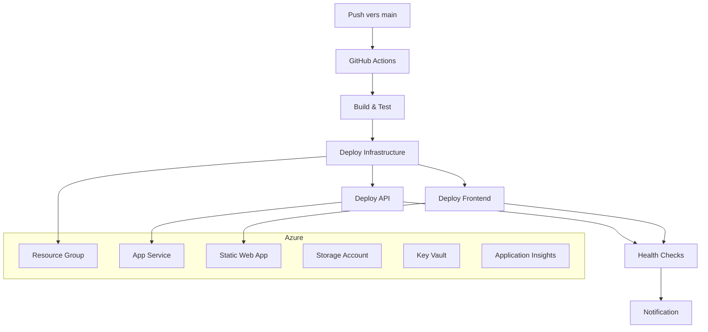

# 🚀 Guide de Configuration GitHub Actions pour Kawoukeravore

## 📋 Vue d'ensemble

Ce guide vous accompagne pour configurer un déploiement automatique vers Azure via GitHub Actions. Le workflow se déclenche automatiquement à chaque push sur la branche `main`.

## 🏗️ Architecture du déploiement



## 🔐 Étape 1: Configuration des Secrets GitHub

### 1.1 Créer un Service Principal Azure

```bash
# Se connecter à Azure
az login

# Créer le service principal avec les permissions Contributor
az ad sp create-for-rbac --name "kawoukeravore-github-actions" \
  --role contributor \
  --scopes /subscriptions/{SUBSCRIPTION-ID} \
  --json-auth

# Résultat à copier pour AZURE_CREDENTIALS
{
  "clientId": "<GUID>",
  "clientSecret": "<STRING>",
  "subscriptionId": "<GUID>",
  "tenantId": "<GUID>"
}
```

### 1.2 Secrets à configurer dans GitHub

Allez sur `https://github.com/cipfarorudy/kawoukeravore/settings/secrets/actions` et ajoutez :

#### **Secrets Azure (Obligatoires)**
```
AZURE_CREDENTIALS
Valeur: Le JSON complet du service principal
Exemple: {"clientId":"xxx","clientSecret":"xxx","subscriptionId":"xxx","tenantId":"xxx"}

AZURE_SUBSCRIPTION_ID  
Valeur: Votre ID d'abonnement Azure
Exemple: 12345678-1234-1234-1234-123456789abc

AZURE_STATIC_WEB_APPS_API_TOKEN
Valeur: Token généré lors de la création du Static Web App
Obtention: Portail Azure > Static Web App > Manage deployment token
```

#### **Secrets Application (Optionnels)**
```
MICROSOFT_CLIENT_ID
Valeur: ID client Azure AD pour l'authentification Microsoft

MICROSOFT_CLIENT_SECRET  
Valeur: Secret client Azure AD

MICROSOFT_TENANT_ID
Valeur: ID tenant Azure AD

WHATSAPP_VERIFY_TOKEN
Valeur: Token de vérification WhatsApp Business API

WHATSAPP_ACCESS_TOKEN  
Valeur: Token d'accès WhatsApp Business API

JWT_SECRET
Valeur: Clé secrète pour signer les tokens JWT
Exemple: openssl rand -base64 32
```

## 🏗️ Étape 2: Préparation Azure

### 2.1 Créer le Resource Group

```bash
# Créer le groupe de ressources
az group create \
  --name kawoukeravore-rg-prod \
  --location "West Europe"
```

### 2.2 Valider le template Bicep

```bash
# Test du template localement
az deployment group validate \
  --resource-group kawoukeravore-rg-prod \
  --template-file azure-infrastructure.bicep \
  --parameters azure-infrastructure.parameters.json
```

## 🔧 Étape 3: Configuration du Repository

### 3.1 Vérifier la structure du projet

```
kawoukeravore/
├── .github/workflows/azure-deploy.yml  ✅
├── azure-infrastructure.bicep          ✅
├── azure-infrastructure.parameters.json ✅
├── staticwebapp.config.json            ✅
├── apps/
│   ├── web/                            ✅
│   │   ├── package.json
│   │   └── dist/ (généré par build)
│   └── api/                            ✅
│       ├── package.json
│       └── src/
└── package.json                        ✅
```

### 3.2 Vérifier les scripts npm

Dans `package.json` racine :
```json
{
  "scripts": {
    "build": "npm run build --workspace=apps/web",
    "start": "npm run start --workspace=apps/api"
  }
}
```

Dans `apps/web/package.json` :
```json
{
  "scripts": {
    "build": "vite build",
    "preview": "vite preview"
  }
}
```

Dans `apps/api/package.json` :
```json
{
  "scripts": {
    "start": "node src/server.js",
    "dev": "nodemon src/server.js"
  }
}
```

## 🚀 Étape 4: Premier Déploiement

### 4.1 Déclencher le workflow

```bash
# Option 1: Push sur main
git add .
git commit -m "🚀 Configure GitHub Actions deployment"
git push origin main

# Option 2: Déclenchement manuel
# Aller sur GitHub > Actions > "Deploy Kawoukeravore to Azure" > Run workflow
```

### 4.2 Surveiller le déploiement

1. **GitHub Actions** : `https://github.com/cipfarorudy/kawoukeravore/actions`
2. **Logs Azure** : Portail Azure > Resource Group > Logs
3. **Application Insights** : Surveillance en temps réel

## 📊 Étape 5: Vérification Post-Déploiement

### 5.1 URLs de vérification

- **Frontend** : `https://kawoukeravore-frontend-prod.azurestaticapps.net`
- **API Health** : `https://kawoukeravore-api-prod.azurewebsites.net/api/health`
- **API Documentation** : `https://kawoukeravore-api-prod.azurewebsites.net/api/docs`

### 5.2 Tests manuels

```bash
# Test API
curl https://kawoukeravore-api-prod.azurewebsites.net/api/health

# Test Frontend  
curl -I https://kawoukeravore-frontend-prod.azurestaticapps.net

# Test performance
curl -w "@curl-format.txt" -o /dev/null -s https://kawoukeravore-frontend-prod.azurestaticapps.net
```

## 🔧 Étape 6: Configuration Domaine Personnalisé

### 6.1 Static Web App (Frontend)

```bash
# Ajouter le domaine personnalisé
az staticwebapp hostname set \
  --name kawoukeravore-frontend-prod \
  --hostname kawoukeravore.top \
  --resource-group kawoukeravore-rg-prod
```

### 6.2 App Service (API)  

```bash
# Ajouter le domaine personnalisé à l'API
az webapp config hostname add \
  --webapp-name kawoukeravore-api-prod \
  --resource-group kawoukeravore-rg-prod \
  --hostname api.kawoukeravore.top
```

### 6.3 Configuration DNS

Chez votre registrar de domaine (`kawoukeravore.top`) :

```
# Pour le frontend
Type: CNAME
Nom: @  
Valeur: kawoukeravore-frontend-prod.azurestaticapps.net

# Pour l'API
Type: CNAME  
Nom: api
Valeur: kawoukeravore-api-prod.azurewebsites.net

# Validation du domaine (si nécessaire)
Type: TXT
Nom: asuid
Valeur: [Fourni par Azure]
```

## 🔄 Workflow Automatique

### Triggers configurés

1. **Push sur `main`** : Déploiement automatique complet
2. **Pull Request** : Build et tests uniquement (pas de déploiement)
3. **Manual** : Déploiement à la demande via l'interface GitHub

### Jobs du pipeline

1. **Build & Test** (2-3 min)
   - Installation des dépendances
   - Build du frontend React
   - Tests (si configurés)
   - Upload des artifacts

2. **Deploy Infrastructure** (3-5 min)
   - Authentification Azure
   - Déploiement Bicep template
   - Configuration des ressources

3. **Deploy API** (2-4 min)
   - Déploiement vers App Service
   - Configuration des variables d'environnement
   - Redémarrage de l'application

4. **Deploy Frontend** (2-3 min)
   - Build et déploiement Static Web App
   - Configuration du CDN
   - Invalidation du cache

5. **Health Checks** (1-2 min)
   - Vérification API
   - Vérification Frontend
   - Tests de performance basiques

6. **Notification** (< 1 min)
   - Rapport de succès/échec
   - URLs de vérification

## 📈 Monitoring et Alertes

### Application Insights configuré pour :

- **Performance** : Temps de réponse, throughput
- **Erreurs** : Exceptions, codes d'erreur HTTP
- **Disponibilité** : Tests de ping automatiques
- **Dépendances** : Base de données, APIs externes

### Alertes automatiques :

- Temps de réponse > 5 secondes
- Taux d'erreur > 5%
- Disponibilité < 99%
- Utilisation CPU > 80%

## 🛠️ Dépannage

### Erreurs communes

1. **Échec d'authentification Azure**
   ```bash
   # Vérifier les secrets GitHub
   echo ${{ secrets.AZURE_CREDENTIALS }}
   
   # Tester l'authentification
   az login --service-principal -u CLIENT_ID -p CLIENT_SECRET --tenant TENANT_ID
   ```

2. **Échec de build**
   ```bash
   # Tester localement
   npm ci
   npm run build
   
   # Vérifier les dépendances
   npm audit
   ```

3. **Échec de déploiement Bicep**
   ```bash
   # Valider le template
   az deployment group validate --resource-group kawoukeravore-rg-prod --template-file azure-infrastructure.bicep
   ```

### Logs utiles

- **GitHub Actions** : Onglet Actions du repository
- **Azure App Service** : Portail Azure > App Service > Log stream  
- **Static Web App** : Portail Azure > Static Web App > Functions
- **Application Insights** : Portail Azure > Application Insights > Logs

## 💰 Coûts Azure (Estimation mensuelle)

| Service | Plan | Coût estimé |
|---------|------|-------------|
| App Service Plan B1 | Basic | ~15€ |
| Static Web App | Free | 0€ |
| Storage Account | Standard LRS | ~2€ |
| Key Vault | Standard | ~1€ |
| Application Insights | Pay-per-GB | ~3€ |
| **Total** | | **~21€** |

## 🔒 Sécurité

### Bonnes pratiques appliquées :

- ✅ HTTPS uniquement
- ✅ Secrets chiffrés dans Key Vault
- ✅ Authentification service principal  
- ✅ Accès réseau contrôlé
- ✅ Logs d'audit complets
- ✅ Monitoring de sécurité

### Recommandations :

1. Rotation des secrets tous les 90 jours
2. Surveillance des tentatives d'accès
3. Backup automatique des données
4. Tests de pénétration réguliers

---

## 🎉 Félicitations !

Une fois cette configuration terminée, vous aurez :

- ✅ **Déploiement automatique** à chaque push
- ✅ **Infrastructure as Code** avec Bicep
- ✅ **Monitoring complet** avec Application Insights
- ✅ **Sécurité renforcée** avec HTTPS et Key Vault
- ✅ **Domaine personnalisé** kawoukeravore.top
- ✅ **CI/CD professionnel** avec GitHub Actions

**Prochaine étape** : Pousser votre code et regarder la magie opérer ! 🚀