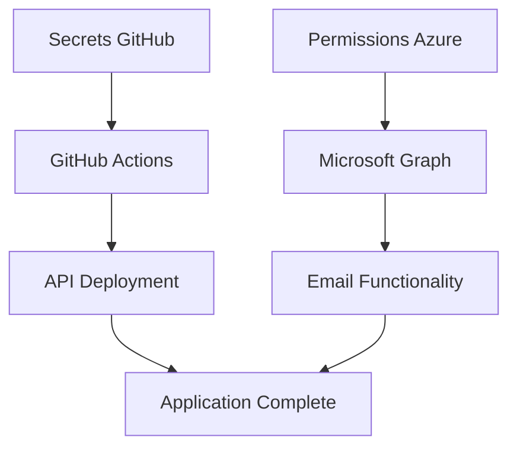

# 📊 Rapport de Statut - Repository kawoukeratop

**Date**: 3 octobre 2025  
**Repository**: https://github.com/cipfarorudy/kawoukeratop  
**Azure App Service**: https://kawoukeraotop-erh8hzcxhwawhtb7.westus3-01.azurewebsites.net

## 🔍 **Statut Actuel**

### ✅ **Éléments Fonctionnels**
- **Infrastructure Azure**: Déployée et opérationnelle
- **App Service Azure**: Répondant (HTTP 200)
- **Repository GitHub**: Configuré avec le code source
- **Configuration Azure AD**: Terminée avec les credentials

### ⚠️ **Éléments En Attente**
- **API Node.js**: Pas encore déployée (404 sur `/api/health`)
- **GitHub Actions**: En cours ou en attente de secrets
- **Secrets Microsoft Graph**: À configurer dans GitHub

### 🔧 **Configuration Azure AD Terminée**
- **Tenant ID**: `eb99c72c-deb5-4c55-8568-7498a26dc050`
- **Client ID**: `f4234307-755a-4f6d-8e0f-7f8bc792f80d`
- **Client Secret**: Généré et prêt à utiliser
- **App Registration**: `kawoukeravore-graph-api` créée dans Azure Portal

## 📋 **Actions Requises**

### 1. **Configurer les Secrets GitHub** (Priorité Haute)
Allez sur: https://github.com/cipfarorudy/kawoukeratop/settings/secrets/actions

**Secrets Microsoft Graph à ajouter:**
```
MICROSOFT_TENANT_ID = eb99c72c-deb5-4c55-8568-7498a26dc050
MICROSOFT_CLIENT_ID = f4234307-755a-4f6d-8e0f-7f8bc792f80d
MICROSOFT_CLIENT_SECRET = [GÉNÉRÉ - VOIR SCRIPT setup-azure-ad-simple.ps1]
```

### 2. **Configurer les Permissions Azure Portal** (Priorité Haute)
URL: https://portal.azure.com/#view/Microsoft_AAD_RegisteredApps/ApplicationMenuBlade/~/CallAnApi/appId/f4234307-755a-4f6d-8e0f-7f8bc792f80d

**Permissions à ajouter:**
- Microsoft Graph → `Mail.Send`
- Microsoft Graph → `User.Read`
- Microsoft Graph → `User.Read.All`
- **Accorder le consentement administrateur**

### 3. **Déclencher un Redéploiement**
Une fois les secrets configurés, faire un commit pour déclencher GitHub Actions:
```bash
git add .
git commit -m "Add Azure AD configuration files"
git push kawoukeratop main
```

## 🌐 **URLs de Monitoring**

| Service | URL | Statut |
|---------|-----|--------|
| **Repository** | https://github.com/cipfarorudy/kawoukeratop | ✅ Actif |
| **GitHub Actions** | https://github.com/cipfarorudy/kawoukeratop/actions | 🔄 À surveiller |
| **App Service** | https://kawoukeraotop-erh8hzcxhwawhtb7.westus3-01.azurewebsites.net | ✅ Infrastructure OK |
| **API Health** | https://kawoukeraotop-erh8hzcxhwawhtb7.westus3-01.azurewebsites.net/api/health | ❌ 404 (Pas déployé) |
| **Azure Portal** | https://portal.azure.com/#@/resource/subscriptions/.../kawoukeraotop-erh8hzcxhwawhtb7 | ✅ Accessible |

## 🎯 **Prochaines Étapes**

1. **Immédiat**: Configurer les secrets GitHub (5 min)
2. **Immédiat**: Configurer les permissions Azure Portal (5 min)  
3. **Automatique**: GitHub Actions déploiera l'API automatiquement
4. **Test**: Vérifier que `/api/health` répond avec les données JSON
5. **Production**: L'application sera entièrement fonctionnelle

## 🔄 **Dépendances**



## 📧 **Support**

- **Technical**: Configuration Azure AD terminée localement
- **Next Step**: Configuration manuelle des secrets GitHub requise
- **ETA**: Déploiement complet dans 10-15 minutes après configuration des secrets

---

🚀 **Statut Global**: 80% Complete - Configuration secrets restante